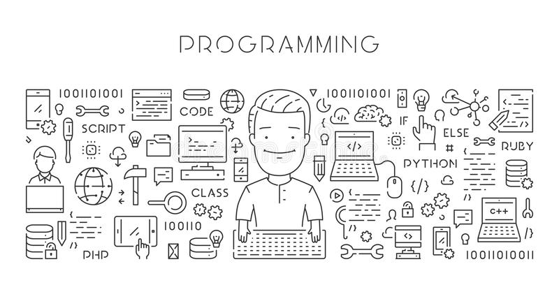

# Programming Fundamentals 
09090016 พื้นฐานการเขียนโปรแกรม

ผู้สอน: ดร.รัฐพรหม พรหมคำ



## ปีการศึกษา 2564/1
รายวิชานี้ดำเนินการสอนในรูปแบบห้องเรียนออนไลน์หรือเป็นไปตามประกาศ
ของทางมหาวิทยาลัยเทคโนโลยีราชมงคลธัญบุรี ขอให้นักศึกษาดำเนินการ
เข้าร่วมห้องเรียนออนไลน์บนระบบ Microsoft Teams โดยใช้ลิงค์ (Link) หรือรหัสการเข้าร่วม (Invitaion Code) ตามกลุ่มเรียนต่อไปนี้
ภายในวันที่ 4 กรกฎาคม 2564 เวลา 16.00

| Section | Invitation Code |Link | 
|---------|------|-----------------|
| Sec 04 | `xlxua3v` | [Join Classroom](https://teams.microsoft.com/l/team/19%3aGYhlDmm8IgeXlggW0WYJ2cN03PfBRJ4WppJ837vkJY01%40thread.tacv2/conversations?groupId=d901b492-cfcb-495b-9acc-af356030cc73&tenantId=0ace20bb-9275-4172-b6f2-52b66dba0f4d)| 

ในกรณีที่นักศึกษาใช้รหัสการเข้าร่วม นักศึกษาสามารถเข้าใช้ห้องเรียนออนไลน์ได้ทันที แต่ถ้าใช้ลิงค์นักศึกษาต้องรอผู้สอนอนุมัติการเข้าร่วมอีกครั้ง 
ภายในวันที่ 5 กรกฎาคม 2564 เวลา 09.00

## เวลาเรียน
วันศุกร์ 08.00 - 12.00 (ทฤษฎี 2 ชั่วโมง/ปฏิบัติ 2 ชั่วโมง)

## คำอธิบายรายวิชา
ขั้นตอนการแก้ปัญหา หลักการทั่วไปเกี่ยวกับการเขียนโปรแกรม องค์ประกอบของประโยคคำสั่ง เช่น ตัวแปร ค่าคงที่ เครื่องหมายกระทำการ นิพจน์ ฟังก์ชัน เป็นต้น ชนิดของข้อมูลแบบต่าง ๆ โครงสร้างข้อมูลแบบอาร์เรย์ โครงสร้างคำสั่งแบบตามลำดับ เลือกทำ และ การวนซ้ำ การเรียกใช้โปรแกรมย่อย การสร้างโปรแกรมย่อย การส่งผ่านค่าภายในโปรแกรม การบันทึกและอ่านข้อมูลจากแฟ้มข้อมูล การตรวจสอบ ทดสอบและแก้ไขโปรแกรม และการใช้เครื่องมือในการพัฒนาโปรแกรม

Algorithmic problem solving, general concepts for computer programming, components of a statement such as variables, constants, operators, expressions, functions, various types of data, structured data types of array, program structures of sequence, selections and repetitions, subroutine calls, program modules, parameter passing, sequential and random access file operation, testing and debugging, using of tools for program development


## จุดมุ่งหมายรายวิชา
1. นักศึกษาเข้าใจหลักการเขียนโปรแกรม
2. นักศึกษาสามารถเขียนรหัสเทียมและผังงานก่อนการพัฒนาซอฟต์แวร์ได้
3. นักศึกษาสามารถพัฒนาซอฟต์แวร์ได้
4. นักศึกษาสามารถประยุกต์ใช้ความรู้การเขียนโปรแกรมไปพัฒนาเป็นซอฟต์แวร์สำหรับงานด้านต่างๆได้

## หัวข้อการบรรยาย


| หัวข้อ | เอกสารประกอบ |
| -----|------------|
| แนะนําภาษาโปรแกรมไพธอน | [เอกสารบทที่ 1](./materials/ch_01/texts.pdf) |
| แนะนําเครื่องมือพัฒนาโปรแกรมด้วยภาษาไพธอน  | [เอกสารบทที่ 2](./materials/ch_02/texts.pdf)  |
| ตัวแปรและชนิดข้อมูลในภาษาโปรแกรมไพธอน | [เอกสารบทที่ 3](./materials/ch_03/texts.pdf) |
| ชนิดข้อมูลสตริง |  |
| โครงสร้างข้อมูลภาษาโปรแกรมไพธอน | |
| คําสั่งควบคุมทิศทางการทํางานโปรแกรม |  |
| ฟังก์ชัน | |
| แนะนําการเขียนโปรแกรมเชิงวัตถุ |  |
| การจัดการข้อผิดพลาด | |
| การใช้งานโมดูลและแพ็คเกจ |  |
| การเชื่อมต่อกับไฟล์ และระบบปฏิบัติการณ์  |  |
| การเขียนส่วนติดต่อผู้ใช้แบบกราฟฟิก|  |


## การวัดผลการเรียน
คะแนนเต็ม 100 คะแนน โดยแบ่งออกเป็น
- การสอบกลางภาค 30%
- การสอบปลายภาค 30%
- งานที่ได้รับมอบหมาย 40%

หากนักศึกษาเข้าเรียนน้อยกว่า 80% ของเวลาเรียนทั้งหมด
หรือได้คะแนนรวมน้อยกว่า 50% ของคะแนนเต็ม นักศึกษาจะไม่ผ่านในรายวิชานี้ และได้รับการบันทึกผลการเรียน F (เกรด 0.0) 

สำหรับนักศึกษาที่ผ่านเกณฑ์ดังกล่าว จะได้รับการบันทึกผลการเรียนตามเกณฑ์ของคะแนน t-score 

```
t-score = 50 + 10*(x - u)/s
```
เมื่อ x คือคะแนนรวม, u คือคะแนนเฉลี่ยของคะแนนรวม และ s คือส่วนเบี่ยงเบนมาตรฐานของคะแนนรวม

ดังนี้

| ผลการเรียน | เกรด | เกณฑ์ t-score |
|---------|------|--------------|
| D | 1.00 | (-Inf, 55) | 
| D+ | 1.50 | [55, 60) | 
| C | 2.00 | [60, 65) |
| C+ | 2.50 | [65, 70) |
| B | 3.00 | [70, 75) |
| B+ | 3.50 | [75, 80) |
| A | 4.00 | [80, Inf) |


## เอกสารอ้างอิง
- Mark Lutz. Learning Python, 5th Edition. O'Reilly Media, Inc. (2013).
- W. McKinney. Python for Data Analysis: Data Wrangling with Pandas, NumPy, and IPython. O'Reilly Media, Inc. (2018)